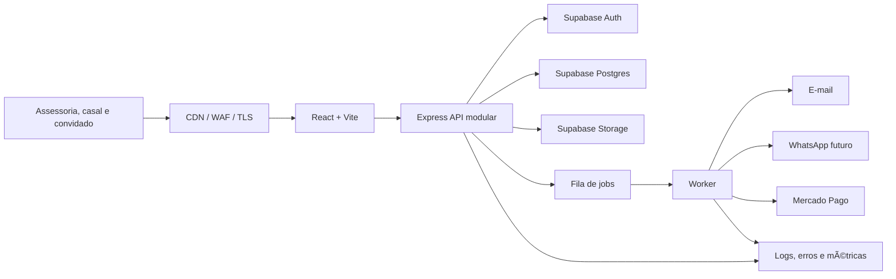

# Arquitetura de produção — ParaSempre Studio

## 1. Veredito técnico

O projeto é um protótipo funcional avançado, mas não deve receber múltiplos clientes reais antes do saneamento P0. O maior risco não é performance; é autorização multi-tenant.

## 2. Bloqueios encontrados no código atual

### P0 — quebra de isolamento e autorização

1. **Admin global sem vínculo com tenant**
   `server/migrate.ts` cria `admin_users` sem `tenant_id`, `organization_id` ou membership.

2. **JWT administrativo não carrega escopo**
   `server/middleware/auth.ts` aceita apenas `userId` e `username`; `requireAuth` verifica assinatura, mas não organização/evento.

3. **Tokens diferentes usam o mesmo segredo e o admin não valida tipo**
   `platformAuth.ts` assina `{ type: 'platform' }` com o mesmo `JWT_SECRET`. `requireAuth` aceita qualquer JWT válido e faz cast para `AuthPayload`. Assim, token de qualquer conta da plataforma pode passar pelas rotas administrativas.

4. **Header define contexto sem verificar permissão**
   `resolveTenantSlug` aceita `X-Tenant-Slug`. Rotas administrativas usam esse slug para buscar dados, sem provar que o usuário pertence ao tenant.

5. **Mutações por ID não filtram tenant**
   Em `server/routes.ts`, update/delete/reorder de presentes, mensagens e RSVP usam somente `WHERE id = $n`. Uma sessão válida pode modificar recurso de outro cliente se conhecer o UUID.

6. **Configuração de qualquer site pode ser alterada**
   `PATCH /site-config` usa o slug do header e não verifica ownership/membership.

7. **Gestão de admins é global**
   Qualquer sessão administrativa lista, cria, edita ou remove usuários globais.

### P0 — integridade do fluxo público

1. **Confirmação de presente forjável**
   `POST /reservations/:giftId/confirm` é público e marca presente como comprado sem token da reserva.

2. **Reserva não valida tenant da requisição**
   O gift é buscado só por ID e a reserva herda seu tenant. O header é ignorado nessa operação.

3. **Detalhe de presente cruza tenant**
   `GET /gifts/:id` busca apenas pelo ID.

4. **Mensagens ocultas expostas**
   `GET /messages` não exige autenticação e só filtra `is_approved` quando o cliente envia `?approved=true`. A ausência do parâmetro retorna inclusive mensagens ocultas.

5. **RSVP permite duplicatas e enumeração operacional**
   Não há convite/token, unique index ou idempotência.

### P0 — pipeline de qualidade e dependências

- `npx tsc --noEmit` falha com 42 erros.
- Vite transpila sem typecheck; portanto `npm run build` verde não significa compilação tipada válida.
- Apenas 6 testes unitários, todos de validação.
- `npm audit --omit=dev` reporta 8 vulnerabilidades: 3 altas, 2 moderadas e 3 baixas.
- `xlsx` 0.18.5 aparece com advisories sem correção disponível no pacote npm usado; substituir por biblioteca mantida ou mover importação para processo isolado e estritamente validado.
- Não há teste E2E, de integração, autorização ou concorrência.
- Não há CI.

### P1 — armazenamento e conteúdo

- Upload usa `multer.memoryStorage`; MIME vem do cliente e aceita qualquer `image/*`, inclusive formatos ativos como SVG.
- Imagens são guardadas como `BYTEA` no banco principal, prejudicando backup, memória e custo.
- Endpoint de imagens não adiciona `X-Content-Type-Options: nosniff` nem política de conteúdo.
- Regeneração de imagem raspa o Bing e baixa conteúdo externo sem limite de resposta, validação real do arquivo ou licença de uso.
- URLs e imagens não são namespaced por organização/evento.

### P1 — operação

- `server/db.ts` fixa `ssl: false`.
- Não há migrations versionadas; `server/migrate.ts`, `supabase/schema.sql` e um `ALTER TABLE` no import de `routes.ts` concorrem como fontes de schema.
- `supabase/schema.sql` está defasado em relação ao runtime e habilita RLS apenas em `gift_items`, com policy pública `USING (true)`.
- O handler de erro é registrado antes das rotas em `server/index.ts`; erros posteriores não ficam cobertos de forma confiável pelo middleware customizado.
- Não há `trust proxy` configurado para rate limit atrás do Railway/reverse proxy.
- CORS vira `*` quando `CORS_ORIGIN` não existe, inclusive por erro de configuração.
- Expiração de reservas usa `setInterval` dentro do processo web; múltiplas réplicas executariam o mesmo job.
- Health check testa apenas `SELECT 1`; não distingue readiness de liveness.
- Não há observabilidade, alertas, tracing, filas, backup testado ou runbook.

### P1 — autenticação e onboarding

- JWTs ficam no `localStorage`.
- Plataforma usa token de 7 dias; admin usa 24 horas; não há refresh/revogação/sessões.
- Senha mínima é 6 caracteres.
- Não há verificação de e-mail, recuperação de senha, MFA ou proteção contra credential stuffing além de rate limit genérico.
- Criar site não cria acesso administrativo compatível; onboarding termina em segundo login.

## 3. Arquitetura alvo

Manter um **modular monolith** até haver escala que justifique separação.



### 3.1 Superfícies

- `www.dominio`: marketing B2B e preços.
- `app.dominio`: studio autenticado e portal do casal.
- `{slug}.dominio` ou `dominio/e/{slug}`: site público.
- Domínios customizados entram após o MVP.

Uma SPA pode continuar no início com code-splitting por surface. Extrair marketing para Astro/Next só se SEO e velocidade comercial justificarem.

### 3.2 Backend por módulos

Estrutura sugerida:

```text
server/
  app.ts
  modules/
    auth/
    organizations/
    memberships/
    events/
    clients/
    sites/
    guests/
    rsvp/
    gifts/
    tasks/
    budgets/
    vendors/
    documents/
    timeline/
    billing/
    notifications/
    audit/
  shared/
    db/
    http/
    authz/
    jobs/
    storage/
    observability/
```

Cada módulo contém schema de entrada, service, repository, rotas, policies e testes. Rotas não executam SQL diretamente.

## 4. Autenticação e autorização

### 4.1 Escolha

Usar Supabase Auth para identidade e remover as duas implementações caseiras (`platform_users` e `admin_users`). E-mail/senha com PKCE no início; magic link e OAuth podem vir depois.

Sessão recomendada:

- access token curto;
- refresh seguro;
- preferir cookie `HttpOnly`, `Secure`, `SameSite=Lax/Strict` mediado pelo backend;
- CSRF token para mutações se autenticação for por cookie;
- nunca guardar `service_role` no frontend.

Se a primeira fase mantiver Bearer token no cliente, aceitar apenas como transição com CSP forte, expiração curta e plano de migração explícito.

### 4.2 Fonte de autorização

Autorização vem das tabelas `organization_memberships` e `event_assignments`, não de `user_metadata` e não do slug/header.

Fluxo de uma requisição autenticada:

1. Validar identidade e sessão.
2. Resolver recurso por ID/slug.
3. Obter `organization_id` do recurso no banco.
4. Verificar membership ativa e papel.
5. Verificar assignment quando o papel não tem acesso global.
6. Verificar entitlement da função.
7. Executar query com `organization_id` e `event_id` no `WHERE`.
8. Auditar ação sensível.

### 4.3 RLS

Mesmo com Express usando conexão confiável, habilitar RLS em todas as tabelas expostas ao Data API. A recomendação atual do Supabase é RLS em todo schema exposto.

Regras:

- mover tabelas internas/billing/jobs para schema não exposto;
- nenhuma policy pública `USING (true)` em tabelas com múltiplos eventos, exceto uma view pública cuidadosamente limitada;
- views públicas usam `security_invoker = true` quando aplicável;
- policies de update têm `USING` e `WITH CHECK`;
- índices em colunas usadas pelas policies;
- permissões em `app_metadata` quando claims forem necessárias; nunca `user_metadata`;
- testar cada policy com usuário A, usuário B, anon e service role.

Mudança recente relevante: tabelas podem não ser expostas automaticamente ao Data/GraphQL API; grants e RLS são controles diferentes e ambos precisam ser configurados quando o Data API for usado.

## 5. Banco e migrações

### 5.1 Fonte única de verdade

- `supabase/migrations/*` passa a ser a única fonte versionada.
- Remover DDL executado no import da aplicação.
- `server/migrate.ts` deixa de criar schema em produção.
- Gerar migrations com CLI, revisar, testar em ambiente efêmero e aplicar via pipeline.
- Usar advisory locks ou mecanismo do provedor para impedir aplicação concorrente.

### 5.2 Convenções

- UUID ou UUIDv7 para chaves.
- `organization_id NOT NULL` em entidades privadas.
- `event_id NOT NULL` quando entidade é de evento.
- `created_at`, `updated_at`, `deleted_at`, `version` onde necessário.
- `timestamptz` em UTC; `event_timezone` IANA.
- dinheiro em `numeric(14,2)` e moeda ISO; aplicação usa centavos/decimal, nunca float.
- unique indexes parciais para recursos ativos.
- FKs com comportamento de delete explícito.
- check constraints para status e valores.

## 6. Billing

### 6.1 Princípio

O provider cobra; o banco local decide acesso a partir de eventos de webhook verificados.

```mermaid
stateDiagram-v2
    [*] --> trialing
    trialing --> active: pagamento aprovado
    trialing --> expired: trial terminou
    active --> past_due: cobrança falhou
    past_due --> grace_period: política de tolerância
    grace_period --> active: pagamento recuperado
    grace_period --> expired: prazo terminou
    active --> canceled: cancelamento no fim do ciclo
    canceled --> expired: período pago terminou
```



### 6.2 Regras

- Checkout criado apenas no backend.
- `external_reference` aponta para subscription local opaca.
- Webhook valida assinatura, busca o objeto no provider quando necessário e persiste evento bruto sanitizado.
- `billing_webhook_events(provider,event_id)` é único.
- Responder webhook rápido; processamento pesado vai para fila.
- Reprocessamento é seguro e idempotente.
- Frontend consulta `/billing/subscription`; não decide plano pelo redirect.
- Adapter `BillingProvider` isola Mercado Pago de domínio.

### 6.3 Grace e downgrade

- 7 dias de `grace_period` como hipótese inicial.
- Durante grace: leitura e operação do evento continuam; criação premium pode ser bloqueada.
- Após expiração: leitura e exportação por prazo contratual, sem novas mutações.
- Downgrade não apaga evento, documento ou usuário automaticamente.

## 7. Storage e documentos

- Supabase Storage ou R2/S3, nunca `BYTEA` no banco principal.
- Buckets privados por padrão.
- Caminho: `{organization_id}/{event_id}/{resource}/{uuid}`.
- Upload direto por URL assinada de curta duração.
- Validação por magic bytes, tamanho, extensão e MIME.
- Bloquear SVG/HTML em origem pública ou sanitizar e servir de domínio separado.
- Scan de malware assíncrono.
- Thumbnails gerados em worker.
- URLs públicas apenas para assets intencionalmente publicados.
- Política de quota por entitlement.
- Exclusão lógica e garbage collection após retenção.

Remover raspagem automática do Bing. Usar uploads licenciados, biblioteca de mídia com API/licença ou geração própria autorizada.

## 8. Jobs e automações

Jobs mínimos:

- expirar reserva;
- enviar notificação;
- processar importação;
- gerar PDF/exportação;
- scan/thumbnail de arquivo;
- processar webhook;
- lembretes e automações;
- purge após retenção.

Requisitos:

- fila persistente baseada em Postgres/serviço gerenciado;
- idempotency key;
- retry exponencial com limite;
- dead-letter e alerta;
- locks por recurso;
- job payload contém IDs, não dados sensíveis completos;
- scheduler único, não `setInterval` em cada réplica web.

## 9. API e HTTP

- Prefixo `/api/v1`.
- JSON e UTF-8.
- Schemas Zod compartilhados apenas como pacote de contrato, sem importar código de servidor no browser.
- Erro padrão `application/problem+json`.
- `request_id` em toda resposta e log.
- Paginação por cursor.
- ETag/version para edição concorrente.
- `Idempotency-Key` em operações suscetíveis a repetição.
- CORS deny-by-default com allowlist por ambiente.
- Helmet/CSP/HSTS/referrer-policy/permissions-policy.
- Body limit explícito no JSON.
- Rate limit por rota, IP e identidade, com `trust proxy` configurado para a topologia real.
- CAPTCHA adaptativo em cadastro, login suspeito, RSVP aberto e recados.

## 10. Frontend

### 10.1 Bundles e rotas

Code-splitting mínimo:

- marketing;
- auth;
- studio;
- portal do casal;
- site público;
- admin/operação;
- importador de planilha carregado somente quando aberto.

Definir budget inicial:

- JS inicial site público < 200 KB gzip;
- JS inicial app autenticado < 300 KB gzip;
- nenhuma dependência pesada no chunk inicial.

### 10.2 Estado

- TanStack Query para server state.
- Form state com React Hook Form + Zod.
- Context apenas para sessão, workspace atual, tema e notificações locais.
- Query keys sempre incluem organização/evento.
- Cache é limpo ao trocar de workspace ou fazer logout.

### 10.3 Mobile e acessibilidade

O layout atual do admin usa sidebar fixa de 256 px e `margin-left`, sem navegação móvel adequada. O painel do Dia D precisa ser mobile-first.

Gates:

- 360 px sem scroll horizontal;
- navegação por teclado;
- foco visível;
- labels reais em inputs;
- mensagens de erro associadas;
- contraste WCAG AA;
- redução de movimento respeitada.

## 11. Observabilidade

### 11.1 Logs

JSON estruturado:

- timestamp;
- level;
- service/version/environment;
- request_id;
- route/status/duration;
- user_id pseudônimo;
- organization_id/event_id;
- error code e stack apenas no coletor privado.

Nunca logar senha, token, chave PIX, corpo de documento, e-mail completo ou mensagem de convidado.

### 11.2 Erros e métricas

- Error tracking frontend/backend.
- Métricas: taxa de erro, latência p50/p95/p99, pool DB, filas, webhook lag, e-mails, uso/storage.
- Alertas: erro 5xx, login anormal, webhook falhando, fila parada, DB saturado, backup falho e domínio/TLS.
- Synthetic checks para landing, login, site público e health/readiness.

## 12. Segurança e LGPD

### 12.1 Papéis legais esperados

Em geral, a assessoria decide a finalidade dos dados de seus clientes/convidados e tende a atuar como controladora; o ParaSempre processa dados sob suas instruções e tende a atuar como operador. Validar com assessoria jurídica e refletir em contrato/DPA.

### 12.2 Controles mínimos

- Termos B2B, política de privacidade e DPA.
- Inventário de dados, finalidade, base legal, retenção e suboperadores.
- Canal para titulares.
- Exportação, correção e exclusão.
- Consentimento separado para marketing.
- Opt-out e listas de supressão.
- Criptografia em trânsito e em repouso.
- Gestão de segredos e rotação.
- 2FA nas contas de infraestrutura.
- Auditoria de acesso privilegiado.
- Plano de resposta a incidente e comunicação.

A LGPD exige medidas de segurança desde a concepção e prevê comunicação de incidentes relevantes. Privacidade não pode ser item pós-lançamento.

## 13. Ambientes e deploy

### 13.1 Ambientes

- Local: dados sintéticos.
- Preview por PR: banco isolado/branch e provider sandbox.
- Staging: configuração próxima de produção, sem dados reais.
- Produção: projetos, credenciais e domínios separados.

### 13.2 Pipeline

Em cada PR:

1. install reprodutível com lockfile;
2. lint/format check;
3. TypeScript;
4. unit tests;
5. integration tests com Postgres;
6. testes de autorização multi-tenant;
7. build e bundle budget;
8. dependency/secret scan;
9. migration dry-run;
10. E2E crítico em preview.

Deploy:

- migrations compatíveis antes do código que depende delas;
- release versionado;
- smoke test automático;
- rollback de aplicação;
- migrations destrutivas em estratégia expand/contract.

## 14. Backup, recuperação e SLO

### Beta pago

- Disponibilidade: 99,5% mensal.
- Backup diário verificado.
- RPO 24 h; RTO 8 h.
- Teste de restore antes do primeiro cliente pago e trimestral.

### Após tração

- PITR habilitado.
- RPO 1 h; RTO 4 h.
- Runbook e responsável de plantão.
- Exportação de storage considerada separadamente: backup do banco não inclui automaticamente objetos do Storage.

## 15. Gates de produção

### Gate A — segurança

- [ ] Uma identidade e memberships implementadas.
- [ ] Nenhuma rota mutável usa autenticação sem autorização.
- [ ] Teste de BOLA/IDOR entre dois workspaces em todos os módulos.
- [ ] RLS/grants revisados.
- [ ] Segredos rotacionados e fora do repositório.
- [ ] Dependências altas corrigidas/substituídas.

### Gate B — qualidade

- [ ] Zero erros TypeScript.
- [ ] Testes unitários, integração e E2E críticos.
- [ ] CI obrigatória na branch principal.
- [ ] Migrações versionadas e testadas.
- [ ] Bundle dentro do budget.

### Gate C — operação

- [ ] Logs, error tracking, métricas e alertas.
- [ ] Backup e restore testados.
- [ ] Jobs persistentes e idempotentes.
- [ ] Runbooks de deploy, rollback e incidente.
- [ ] Suporte e status page definidos.

### Gate D — negócio e legal

- [ ] Billing real com webhook idempotente.
- [ ] Entitlements no servidor.
- [ ] Termos, privacidade, DPA e política de retenção.
- [ ] Fluxo de exportação/exclusão.
- [ ] Onboarding sem segundo login.

## 16. Referências técnicas

- Supabase RLS: https://supabase.com/docs/guides/database/postgres/row-level-security
- Supabase produção: https://supabase.com/docs/guides/deployment/going-into-prod
- Supabase segurança da API: https://supabase.com/docs/guides/api/securing-your-api
- Supabase segurança de produtos: https://supabase.com/docs/guides/security/product-security
- Mercado Pago webhooks: https://www.mercadopago.com.br/developers/pt/docs/subscriptions/additional-content/your-integrations/notifications/webhooks
- LGPD: https://www.planalto.gov.br/ccivil_03/_ato2015-2018/2018/lei/l13709compilado.htm
